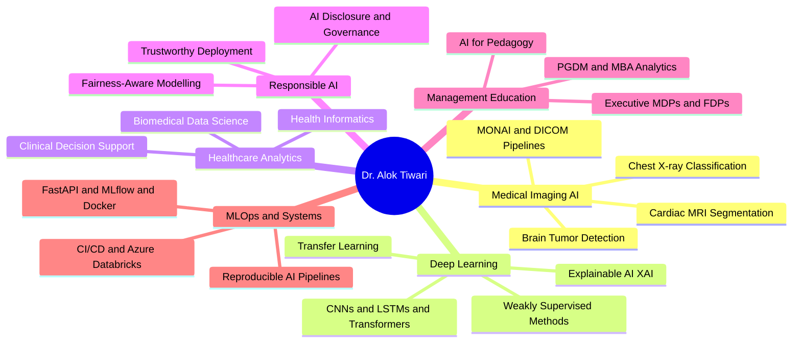

<!-- HEADER BANNER -->

 

<!-- ANIMATED TYPING -->

  

<!-- BADGE ROW -->

 

  

---

<h2>⚡ Quick Numbers</h2>

| 🎓 PhD | 📄 Publications | 📊 Citations | 🏫 Courses | 🏢 MDPs | 👩‍💻 Mentees |
|:---:|:---:|:---:|:---:|:---:|:---:|
| IIT-BHU, 2023 | 4 Journals · 1 Book Chapter · 3 Conf. | 44 · h-index 4 | 7 PGDM Courses | 4 Industry Clients | 29 Students |

---

## 🧠 About Me

I work at a specific intersection: deep learning systems for medical imaging, and the challenge of making those systems legible to clinicians and decision-makers. My PhD research centred on weakly supervised segmentation for cardiac MRI and transfer learning for COVID-19 detection from chest X-rays. At GIM Goa, I teach healthcare analytics and machine learning to PGDM students who are mostly not coders — which makes translation as interesting as the research itself.

Outside the classroom, I am usually somewhere in a manuscript pipeline: computational psychiatry, agricultural ML, AI washing and narrative-capability gaps, fairness-aware credit scoring. I also run executive programmes for IOCL, Delhivery, Konkan Railways, and MetLife — a strange and rewarding combination.

If you are working on medical imaging AI, explainable AI, or AI for health systems, I am likely interested in talking.

---

## 🔬 Research Domains

---

## 🚀 Featured Projects

| 🏆 Project | 💡 What It Does |
|:---|:---|
| [**AI-Resistant-Assessment-Studio**](https://github.com/dr-alok-tiwari/AI-Resistant-Assessment-Studio) | Designs assessments that test genuine reasoning — not recall a chatbot can replicate. GenAI-era pedagogy in practice. |
| [**brain_tumor_classification**](https://github.com/dr-alok-tiwari/brain_tumor_classification) | Deep learning pipeline for MRI-based tumor classification. Core medical imaging work. |
| [**AshaAid**](https://github.com/dr-alok-tiwari/AshaAid) | Human-centered applied AI for social and health impact. Prototype stage. |
| [**fix-the-friction-staff-retreat-2026**](https://github.com/dr-alok-tiwari/fix-the-friction-staff-retreat-2026) | Stakeholder inputs converted into an interactive institutional decision-support presentation. |
| [**dr-alok-tiwari.github.io**](https://github.com/dr-alok-tiwari/dr-alok-tiwari.github.io) | Academic portfolio — research, teaching, and collaboration in one place. |
| [**ai4edu.github.io**](https://github.com/dr-alok-tiwari/ai4edu.github.io) | Public AI learning hub for students, educators, and curious practitioners. |

---

## 📚 Publications

### Journal Articles

> **2023**

🔹 *Cascaded conventional + deep learning model for weakly supervised left-ventricle segmentation in cardiac MRI*
**IETE Technical Review**, Taylor & Francis — Q2 · [`DOI: 10.1080/02564602.2022.2055668`](https://doi.org/10.1080/02564602.2022.2055668)

🔹 *Comprehensive review on technological advances in alternate drug discovery and drug repurposing*
**Current Trends in Biotechnology and Pharmacy** · [`DOI: 10.5530/ctbp.2023.17`](https://doi.org/10.5530/ctbp.2023.17)

> **2022**

🔹 *Detection of COVID-19 infection in CT and X-ray images using transfer learning*
**Technology and Health Care**, IOS Press — Q3 · [`DOI: 10.3233/THC-220114`](https://doi.org/10.3233/THC-220114)

🔹 *Deep learning-based automated multiclass classification of chest X-rays into COVID-19, normal, bacterial pneumonia, and viral pneumonia*
**Cogent Engineering**, Taylor & Francis — Q2 · [`DOI: 10.1080/23311916.2022.2105559`](https://doi.org/10.1080/23311916.2022.2105559)

### Other Scholarly Output

📖 **Springer Book Chapter** — Neuroimaging tools for cerebrovascular blockage localisation
🎤 **Conference Papers** — Brain stroke detection (DL) · Modified Pan-Tompkins ECG arrhythmia detection · Simulink-based cardiac arrhythmia modelling

### 🔄 Active Manuscript Pipeline

> `computational psychiatry` · `bioinformatics` · `sustainable agriculture ML` · `AI washing / narrative-capability gaps` · `HRM value profiles` · `fairness-aware credit scoring`

---

## 🛠️ Technical Stack

**Languages & Core**
 

  

**MLOps · DevOps · Cloud**
 

  

**Databases & Frontend**
 

  

 

| Area | Tools & Methods |
|:---|:---|
| **Programming** | Python · R · MATLAB · SQL · NoSQL · LaTeX |
| **Deep Learning & ML** | PyTorch · TensorFlow · Keras · scikit-learn · OpenCV · CUDA · MONAI · CNN · LSTM · Transformers · LLMs |
| **XAI & Responsible AI** | SHAP · LIME · Grad-CAM · Fairness-aware modelling |
| **Data Science & Viz** | NumPy · Pandas · Matplotlib · Seaborn · Plotly · Tableau · Power BI |
| **MLOps & DevOps** | Git · Docker · Jenkins · CI/CD · MLflow · FastAPI · GitHub Actions |
| **Big Data** | Hadoop · Spark · Hive · Kafka · Spark Streaming |
| **Medical Imaging** | MONAI · DICOM · ImageJ · FSLeyes · MATLAB Image Toolbox |
| **Cloud & HPC** | Azure · Azure Data Factory · Azure Databricks · Param Shivay Supercomputer |

---

## 🎓 Teaching & Executive Education

### PGDM / MBA Courses at GIM Goa

| Course | Programme |
|:---|:---|
| Healthcare Analytics | PGDM-HCM |
| Machine Learning with Generative AI | PGDM-BDA |
| MLOps (Managerial) | PGDM-BDA |
| Introduction to Programming: Python & R | PGDM-BDA |
| AR/VR for Managers | PGDM |
| Operations Strategy in the Era of AI | PGDM |
| Logical Reasoning & Critical Thinking | PGDM |

### Industry Executive Programmes (MDPs / FDPs)

| Organisation | Programme |
|:---|:---|
| 🛢️ Indian Oil Corporation (IOCL) | Business Analytics for Decision Making — 5-day MDP, 100+ senior executives |
| 🚚 Delhivery | Storytelling with Data |
| 🚂 Konkan Railways | AI in Railways |
| 🏦 MetLife | AI in Accounting and Finance |
| 🏛️ Govt. of Goa / E&ICT Academy | Python · Generative AI · AI Tools for Pedagogy (FDP) |

---

## 🏅 Awards & Recognition

| Honour | Details |
|:---:|:---|
| 🥇 | Senior Research Fellow (SRF) — MHRD, Govt. of India, IIT-BHU |
| 🥈 | Junior Research Fellow (JRF) — MHRD, Govt. of India, IIT-BHU |
| 🎖️ | Teaching Assistantship — MHRD, Govt. of India, NIT Kurukshetra |
| 📜 | Appreciation Letter — Govt. of Goa / E&ICT Academy, Feb 2026 |
| ✅ | GATE Qualified — 2014 · 2016 · 2017 |
| 🎓 | M.Tech with Honours — NIT Kurukshetra |
| 🎓 | B.Tech with Honours — Gautam Buddha Technical University |
| 📖 | Journal Reviewer — *Journal of Human Values* |
| 📚 | Technical Book Reviewer — Packt Publishing (AI/ML titles) |

---

## 📊 GitHub Activity

 

 

---

## 🤝 Let's Collaborate

I am open to collaborations in **medical imaging AI · healthcare analytics · explainable AI · responsible AI · MLOps · AI for education · executive analytics training**.

If you are building something at those intersections, reach out.

 

  

