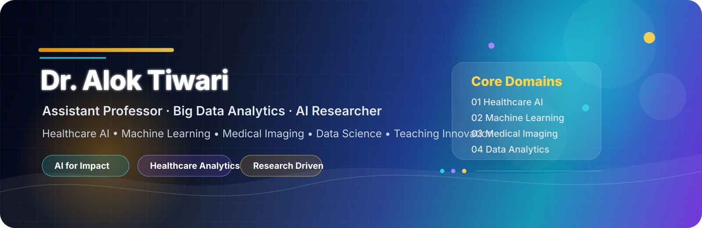
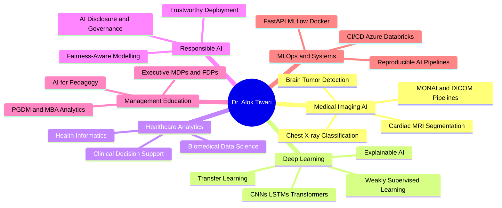

<!-- Dr. Alok Tiwari — GitHub Profile README -->
<!-- Theme: Deep Navy · Cyan · Violet · Gold -->

  

  
  
  
  
  

  
  

  

---

## ⚡ At a Glance

| 🎓 PhD | 📄 Publications | 📊 Citations | 🏫 Courses | 🏢 Industry MDPs | 👩‍💻 Mentees |
|:--:|:----:|:----:|:----:|:----:|:---:|
| IIT-BHU · 2023 | 4 Journals · 1 Book Chapter · 3 Conf. | 44 · h-index 4 | 7 PGDM Courses | 4 Clients · 100+ Executives | 29 Students |

---

## 🧠 About

I work at a specific intersection: deep learning systems for medical imaging, and the challenge of making those systems legible to clinicians and decision-makers. My PhD research focused on weakly supervised segmentation in cardiac MRI and transfer learning for COVID-19 detection from chest X-rays. At GIM Goa, I teach healthcare analytics and machine learning to PGDM students who are mostly not coders — which makes translation as interesting as the research itself.

Outside the classroom, I am usually in a manuscript pipeline: computational psychiatry, agricultural ML, AI washing and narrative-capability gaps, fairness-aware credit scoring. I also run executive programmes for IOCL, Delhivery, Konkan Railways, and MetLife.

If you are working on medical imaging AI, explainable AI, or AI for health systems — I am interested in talking.

---

## 🔬 Research Map

---

## 🚀 Featured Projects

| Project | What It Does |
|:---|:---|
| [**AI-Resistant-Assessment-Studio**](https://github.com/dr-alok-tiwari/AI-Resistant-Assessment-Studio) | Designs assessments that test genuine reasoning — not recall a chatbot can replicate. GenAI-era pedagogy in practice. |
| [**brain_tumor_classification**](https://github.com/dr-alok-tiwari/brain_tumor_classification) | Deep learning pipeline for MRI-based brain tumor classification. Covers preprocessing, modelling, evaluation, and explainability. |
| [**AshaAid**](https://github.com/dr-alok-tiwari/AshaAid) | Human-centered applied AI targeting social and health impact contexts. Focused on accessibility and real-world deployability. |
| [**fix-the-friction-staff-retreat-2026**](https://github.com/dr-alok-tiwari/fix-the-friction-staff-retreat-2026) | Converts stakeholder inputs into an interactive institutional decision-support presentation. |
| [**dr-alok-tiwari.github.io**](https://github.com/dr-alok-tiwari/dr-alok-tiwari.github.io) | Academic portfolio — research, teaching, projects, and collaborations. Central professional web identity. |
| [**ai4edu.github.io**](https://github.com/dr-alok-tiwari/ai4edu.github.io) | Public AI learning hub for students, educators, and curious practitioners. Concepts, tools, and curated resources. |

---

## 📚 Publications

**2023**

🔹 *Cascaded conventional + deep learning model for weakly supervised left-ventricle segmentation in cardiac MRI*
**IETE Technical Review**, Taylor & Francis — Q2 · [DOI: 10.1080/02564602.2022.2055668](https://doi.org/10.1080/02564602.2022.2055668)

🔹 *Comprehensive review on technological advances in alternate drug discovery and drug repurposing*
**Current Trends in Biotechnology and Pharmacy** · [DOI: 10.5530/ctbp.2023.17](https://doi.org/10.5530/ctbp.2023.17)

**2022**

🔹 *Detection of COVID-19 infection in CT and X-ray images using transfer learning*
**Technology and Health Care**, IOS Press — Q3 · [DOI: 10.3233/THC-220114](https://doi.org/10.3233/THC-220114)

🔹 *Deep learning-based automated multiclass classification of chest X-rays into COVID-19, normal, bacterial pneumonia, and viral pneumonia*
**Cogent Engineering**, Taylor & Francis — Q2 · [DOI: 10.1080/23311916.2022.2105559](https://doi.org/10.1080/23311916.2022.2105559)

📖 **Springer Book Chapter** — Neuroimaging tools for cerebrovascular blockage localisation
🎤 **Conference Papers** — Brain stroke detection (DL) · Modified Pan-Tompkins ECG arrhythmia · Simulink-based cardiac modelling

**Active Pipeline** — `computational psychiatry` · `bioinformatics` · `sustainable agriculture ML` · `AI washing / narrative-capability gaps` · `HRM value profiles` · `fairness-aware credit scoring`

---

## 🛠️ Technical Stack

  

  
  
  
  
  
  
  
  
  
  

| Area | Tools |
|:---|:---|
| **Programming** | Python · R · MATLAB · SQL · NoSQL · LaTeX |
| **Deep Learning & ML** | PyTorch · TensorFlow · Keras · scikit-learn · OpenCV · CUDA · MONAI · CNN · LSTM · Transformers · LLMs |
| **XAI & Responsible AI** | SHAP · LIME · Grad-CAM · Fairness-aware modelling |
| **Data Science & Viz** | NumPy · Pandas · Matplotlib · Seaborn · Plotly · Tableau · Power BI |
| **MLOps & DevOps** | Git · Docker · Jenkins · CI/CD · MLflow · FastAPI · GitHub Actions |
| **Big Data** | Hadoop · Spark · Hive · Kafka · Spark Streaming |
| **Medical Imaging** | MONAI · DICOM · ImageJ · FSLeyes · MATLAB Image Toolbox |
| **Cloud & HPC** | Azure · Azure Data Factory · Azure Databricks · Param Shivay Supercomputer |

---

## 🎓 Teaching & Executive Education

**PGDM / MBA — Goa Institute of Management**

| Course | Programme |
|:---|:---:|
| Healthcare Analytics | PGDM-HCM |
| Machine Learning with Generative AI | PGDM-BDA |
| MLOps (Managerial) | PGDM-BDA |
| Introduction to Programming: Python & R | PGDM-BDA |
| AR/VR for Managers | PGDM |
| Operations Strategy in the Era of AI | PGDM |
| Logical Reasoning & Critical Thinking | PGDM |

**Industry MDPs / FDPs**

| Organisation | Programme |
|:---|:---|
| 🛢️ Indian Oil Corporation (IOCL) | Business Analytics for Decision Making — 5-day MDP · 100+ senior executives |
| 🚚 Delhivery | Storytelling with Data |
| 🚂 Konkan Railways | AI in Railways |
| 🏦 MetLife | AI in Accounting and Finance |
| 🏛️ Govt. of Goa / E&ICT Academy | Python · Generative AI · AI Tools for Pedagogy (FDP) |

**Supervision** — 14 PGDM-HCM students on healthcare management research · 15 students on summer internships · Faculty seminars at IIT Delhi DMS and IIT Kharagpur VGSOM

---

## 🏅 Awards & Service

| | |
|:---:|:---|
| 🥇 | Senior Research Fellow (SRF) — MHRD, Govt. of India, IIT-BHU |
| 🥈 | Junior Research Fellow (JRF) — MHRD, Govt. of India, IIT-BHU |
| 🎖️ | Teaching Assistantship — MHRD, Govt. of India, NIT Kurukshetra |
| 📜 | Appreciation Letter — Govt. of Goa / E&ICT Academy, Feb 2026 |
| ✅ | GATE Qualified — 2014 · 2016 · 2017 |
| 🎓 | M.Tech with Honours — NIT Kurukshetra |
| 🎓 | B.Tech with Honours — Gautam Buddha Technical University |
| 📖 | Journal Reviewer — *Journal of Human Values* |
| 📚 | Technical Book Reviewer — Packt Publishing (AI/ML titles) |

---

## 📊 GitHub Activity

  
  

  

  

  

---

## 🤝 Collaboration

Open to collaborations in medical imaging AI, healthcare analytics, explainable AI, responsible AI, MLOps, AI for education, and executive analytics training. If you are building something at those intersections, reach out.

  
  
  

---

  

