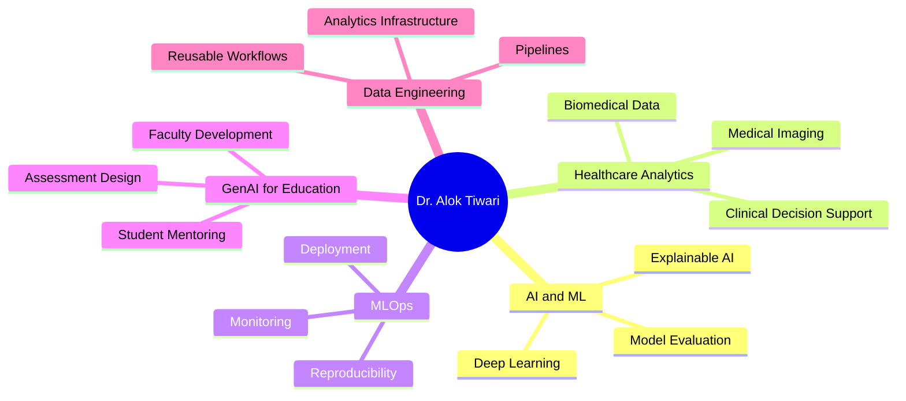

<!--
Profile README for: https://github.com/dr-alok-tiwari
Place this file inside a public repository named exactly: dr-alok-tiwari
-->

### Assistant Professor - Big Data Analytics | PhD, IIT-BHU | AI for Real-World Decision Systems

I build and teach applied AI systems across healthcare analytics, computer vision, MLOps, data engineering, generative AI, and management education. My GitHub is organized around practical prototypes, research-support tools, classroom resources, and curated technical learning pathways.

---

## What I Work On

<table>
<tr>
<td width="50%" valign="top">

### Applied AI and ML
- Machine learning and deep learning prototypes
- Computer vision for medical and business use cases
- Explainable AI and model evaluation workflows
- AI-assisted research and decision-support tools

</td>
<td width="50%" valign="top">

### Teaching, Research, and Management Analytics
- Healthcare analytics and medical imaging education
- AI for education, assessment design, and faculty development
- MLOps, data engineering, and analytics deployment
- Research writing, literature review, and academic productivity tools

</td>
</tr>
</table>

---

## Featured Original Projects

> These are the repositories that should lead the profile because they reflect original work, applied problem-solving, teaching innovation, or healthcare/AI alignment.

| Project | Focus | Why it matters |
|---|---|---|
| [AI-Resistant-Assessment-Studio](https://github.com/dr-alok-tiwari/AI-Resistant-Assessment-Studio) | AI in Education, Assessment Design | Helps redesign assessments so they evaluate reasoning, originality, and applied understanding. |
| [fix-the-friction-staff-retreat-2026](https://github.com/dr-alok-tiwari/fix-the-friction-staff-retreat-2026) | Institutional Process Analytics | Converts stakeholder pain points into an interactive decision-support presentation. |
| [dr-alok-tiwari.github.io](https://github.com/dr-alok-tiwari/dr-alok-tiwari.github.io) | Portfolio, GitHub Pages | Central academic and professional web identity. |
| [ai4edu.github.io](https://github.com/dr-alok-tiwari/ai4edu.github.io) | AI for Education | Dedicated web presence for AI-enabled teaching and learning resources. |
| [AshaAid](https://github.com/dr-alok-tiwari/AshaAid) | AI for Social/Health Impact | Candidate flagship project for applied AI with human-centered positioning. |
| [brain_tumor_classification](https://github.com/dr-alok-tiwari/brain_tumor_classification) | Medical Imaging, Deep Learning | Aligns directly with healthcare AI and computer vision research expertise. |

---

## Curated Learning and Reference Repositories

I also maintain and fork selected high-value resources for teaching, self-learning, and student mentoring. These should be presented as curated resources, not as primary original work.

| Area | Examples |
|---|---|
| Generative AI and Agents | [GenAI_Agents](https://github.com/dr-alok-tiwari/GenAI_Agents), [Hands-On-Large-Language-Models](https://github.com/dr-alok-tiwari/Hands-On-Large-Language-Models), [ai-agents-for-beginners](https://github.com/dr-alok-tiwari/ai-agents-for-beginners) |
| Prompt Engineering | [Prompt-Engineering-Guide](https://github.com/dr-alok-tiwari/Prompt-Engineering-Guide) |
| MLOps | [mlops-aml](https://github.com/dr-alok-tiwari/mlops-aml), [dtu_mlops](https://github.com/dr-alok-tiwari/dtu_mlops), [practical-mlops-book](https://github.com/dr-alok-tiwari/practical-mlops-book) |
| Data Engineering | [awesome-data-engineering](https://github.com/dr-alok-tiwari/awesome-data-engineering), [data-engineer-handbook](https://github.com/dr-alok-tiwari/data-engineer-handbook), [data-engineering-wiki](https://github.com/dr-alok-tiwari/data-engineering-wiki) |
| Data Science | [Data-Science-Handbook](https://github.com/dr-alok-tiwari/Data-Science-Handbook), [awesome-python-data-science](https://github.com/dr-alok-tiwari/awesome-python-data-science) |

---

## Research and Teaching Themes

---

## Tech Stack

---

## Current Focus Areas

- Building interactive AI and analytics tools for education, research, and institutional decision-making.
- Strengthening healthcare AI projects with cleaner READMEs, reproducible workflows, demos, and citations.
- Converting classroom and FDP/MDP material into reusable open learning assets.
- Organizing repositories into flagship projects, teaching resources, curated references, and archived experiments.

---

## GitHub Activity

---

## Repository Map

| Category | What belongs here | Action |
|---|---|---|
| Flagship Original Projects | AI-Resistant-Assessment-Studio, AshaAid, brain_tumor_classification | Pin, improve README, add screenshots, add demo |
| Teaching and Academic Tools | ai4edu.github.io, assessment tools, course demos | Add learning outcomes and classroom use cases |
| Healthcare AI | Medical imaging, X-ray/MRI/tumor classification | Add dataset notes, ethics note, reproducibility steps |
| MLOps and Deployment | Flask/Streamlit apps, CI/CD, deployment examples | Add architecture diagram and setup commands |
| Curated Learning Resources | Forked books, guides, lists | Keep but label clearly as curated/forked resources |
| Archive Candidates | Old experiments, empty repos, duplicate forks | Archive or make private if not central to profile |

---

## Suggested Pinned Repositories

1. `AI-Resistant-Assessment-Studio` — strongest education-AI positioning.
2. `fix-the-friction-staff-retreat-2026` — shows practical institutional analytics and interactive presentation skills.
3. `dr-alok-tiwari.github.io` — portfolio hub.
4. `ai4edu.github.io` — AI for education identity.
5. `AshaAid` — social/health impact project.
6. `brain_tumor_classification` — healthcare AI and computer vision alignment.

---

## Collaboration

I am open to collaborations in applied AI, healthcare analytics, educational technology, MLOps, data science curriculum design, and research-support tooling.

---

**AI for real-world challenges | Healthcare analytics | Management education | Research-ready systems**

