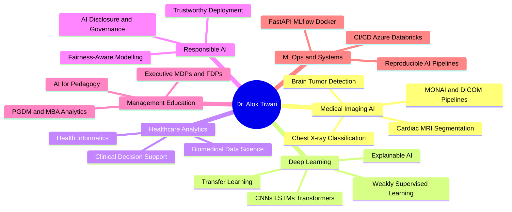

<!-- Dr. Alok Tiwari — GitHub Profile README -->
<!-- Theme: Deep Navy · Cyan · Violet · Gold -->

  

  
  
  
  
  

  
  
  

---

## ⚡ At a Glance

<table width="100%">
<tr>
<td align="center" width="16%"><b>🎓 PhD</b> IIT-BHU · 2023</td>
<td align="center" width="16%"><b>📄 Publications</b> 4 Journals · 1 Book Chapter · 3 Conf.</td>
<td align="center" width="16%"><b>📊 Citations</b> 44 · h-index 4</td>
<td align="center" width="16%"><b>🏫 Courses</b> 7 PGDM Courses</td>
<td align="center" width="16%"><b>🏢 Industry MDPs</b> 4 Clients · 100+ Executives</td>
<td align="center" width="16%"><b>👩‍💻 Mentees</b> 29 Students</td>
</tr>
</table>

---

## 🧠 About &nbsp;&nbsp;&nbsp;&nbsp;&nbsp;&nbsp;&nbsp;&nbsp;&nbsp;&nbsp;&nbsp;&nbsp;&nbsp;&nbsp;&nbsp;&nbsp;&nbsp;&nbsp;&nbsp;&nbsp;&nbsp;&nbsp;&nbsp;&nbsp;&nbsp;&nbsp;&nbsp;&nbsp;&nbsp;&nbsp;&nbsp;&nbsp;&nbsp;&nbsp;&nbsp;&nbsp;&nbsp;&nbsp;&nbsp;&nbsp;&nbsp;&nbsp;&nbsp;&nbsp;&nbsp;&nbsp;&nbsp;&nbsp;&nbsp;&nbsp;&nbsp;&nbsp;&nbsp;&nbsp;&nbsp;&nbsp;&nbsp;&nbsp;&nbsp;&nbsp;&nbsp;&nbsp;&nbsp;&nbsp;&nbsp;&nbsp;&nbsp;&nbsp;&nbsp;&nbsp;&nbsp;&nbsp;&nbsp;&nbsp;&nbsp;&nbsp;&nbsp;&nbsp;&nbsp;&nbsp;&nbsp;&nbsp;&nbsp;&nbsp;&nbsp;&nbsp;&nbsp;&nbsp;&nbsp;&nbsp;&nbsp;&nbsp;&nbsp;

<table width="100%">
<tr>
<td width="60%" valign="top">

I work at a specific intersection: deep learning systems for medical imaging, and the challenge of making those systems legible to clinicians and decision-makers. My PhD research focused on weakly supervised segmentation in cardiac MRI and transfer learning for COVID-19 detection from chest X-rays.

At GIM Goa, I teach healthcare analytics and machine learning to PGDM students who are mostly not coders — which makes translation as interesting as the research itself. Outside the classroom, I'm usually somewhere in a manuscript pipeline: computational psychiatry, agricultural ML, AI washing and narrative-capability gaps, fairness-aware credit scoring.

If you are working on medical imaging AI, explainable AI, or AI for health systems — I'm interested in talking.

</td>
<td width="40%" valign="top">

**Research Focus**
- 🫁 Medical Imaging AI — Chest X-ray, Cardiac MRI, Brain Tumor
- 🤖 Deep Learning — Transfer Learning, Weakly Supervised, XAI
- 🏥 Healthcare Analytics — Clinical Decision Support, Informatics
- ⚖️ Responsible AI — Fairness-aware modelling, Governance
- ⚙️ MLOps — FastAPI · MLflow · Docker · CI/CD · Azure

**Current Pipeline**
`computational psychiatry` · `agricultural ML` · `AI washing` · `fairness-aware credit scoring` · `HRM value profiles` · `bioinformatics`

</td>
</tr>
</table>

---

## 🔬 Research Map

---

## 🚀 Featured Projects

<table width="100%">
<tr>
<td width="50%" valign="top">

### 🧪 [AI-Resistant-Assessment-Studio](https://github.com/dr-alok-tiwari/AI-Resistant-Assessment-Studio)
Designs assessments that evaluate genuine reasoning — not recall a chatbot can replicate. Built for GenAI-era pedagogy. Covers rubric design, contextual tasks, and originality-first evaluation frameworks.

### 🧠 [brain_tumor_classification](https://github.com/dr-alok-tiwari/brain_tumor_classification)
Deep learning pipeline for MRI-based brain tumor classification. Covers preprocessing, model training, evaluation, and explainability. Core medical imaging research work.

### 🤝 [AshaAid](https://github.com/dr-alok-tiwari/AshaAid)
Human-centered applied AI targeting social and health impact contexts. Prototype stage — focused on accessibility and real-world deployability.

</td>
<td width="50%" valign="top">

### 📊 [fix-the-friction-staff-retreat-2026](https://github.com/dr-alok-tiwari/fix-the-friction-staff-retreat-2026)
Converts stakeholder inputs into an interactive institutional decision-support presentation. Institutional analytics applied to real organisational challenges.

### 🌐 [dr-alok-tiwari.github.io](https://github.com/dr-alok-tiwari/dr-alok-tiwari.github.io)
Academic portfolio — research, teaching, projects, and collaborations. Central professional web identity with publications, course listings, and project showcases.

### 📚 [ai4edu.github.io](https://github.com/dr-alok-tiwari/ai4edu.github.io)
Public AI learning hub for students, educators, and curious practitioners. Concepts, tools, use cases, and curated resources for AI in education.

</td>
</tr>
</table>

---

## 📚 Publications

<table width="100%">
<tr>
<td width="50%" valign="top">

**2023**

🔹 *Cascaded conventional + deep learning model for weakly supervised left-ventricle segmentation in cardiac MRI*
**IETE Technical Review**, Taylor & Francis — Q2
[DOI: 10.1080/02564602.2022.2055668](https://doi.org/10.1080/02564602.2022.2055668)

🔹 *Comprehensive review on technological advances in alternate drug discovery and drug repurposing*
**Current Trends in Biotechnology and Pharmacy**
[DOI: 10.5530/ctbp.2023.17](https://doi.org/10.5530/ctbp.2023.17)

📖 **Springer Book Chapter** — Neuroimaging tools for cerebrovascular blockage localisation

🎤 **Conference Papers** — Brain stroke detection (DL) · Modified Pan-Tompkins ECG arrhythmia · Simulink-based cardiac arrhythmia modelling

</td>
<td width="50%" valign="top">

**2022**

🔹 *Detection of COVID-19 infection in CT and X-ray images using transfer learning*
**Technology and Health Care**, IOS Press — Q3
[DOI: 10.3233/THC-220114](https://doi.org/10.3233/THC-220114)

🔹 *Deep learning-based automated multiclass classification of chest X-rays into COVID-19, normal, bacterial pneumonia, and viral pneumonia*
**Cogent Engineering**, Taylor & Francis — Q2
[DOI: 10.1080/23311916.2022.2105559](https://doi.org/10.1080/23311916.2022.2105559)

**Active Manuscript Pipeline**

`computational psychiatry` · `bioinformatics` · `sustainable agriculture ML` · `AI washing / narrative-capability gaps` · `HRM value profiles` · `fairness-aware credit scoring`

</td>
</tr>
</table>

---

## 🛠️ Technical Stack

<table width="100%">
<tr>
<td width="33%" align="center" valign="top">

**Languages & Core ML**

</td>
<td width="33%" align="center" valign="top">

**MLOps · DevOps · Cloud**

</td>
<td width="33%" align="center" valign="top">

**Data & Frontend**

</td>
</tr>
</table>

<table width="100%">
<tr>
<td width="50%" valign="top">

| Area | Tools |
|:---|:---|
| **Programming** | Python · R · MATLAB · SQL · NoSQL · LaTeX |
| **Deep Learning & ML** | PyTorch · TensorFlow · Keras · scikit-learn · OpenCV · CUDA · MONAI · CNN · LSTM · Transformers · LLMs |
| **XAI & Responsible AI** | SHAP · LIME · Grad-CAM · Fairness-aware modelling |
| **Data Science & Viz** | NumPy · Pandas · Matplotlib · Seaborn · Plotly · Tableau · Power BI |

</td>
<td width="50%" valign="top">

| Area | Tools |
|:---|:---|
| **MLOps & DevOps** | Git · Docker · Jenkins · CI/CD · MLflow · FastAPI · GitHub Actions |
| **Big Data** | Hadoop · Spark · Hive · Kafka · Spark Streaming |
| **Medical Imaging** | MONAI · DICOM · ImageJ · FSLeyes · MATLAB Image Toolbox |
| **Cloud & HPC** | Azure · Azure Data Factory · Azure Databricks · Param Shivay Supercomputer |

</td>
</tr>
</table>

---

## 🎓 Teaching & Executive Education

<table width="100%">
<tr>
<td width="50%" valign="top">

### PGDM / MBA — Goa Institute of Management

| Course | Programme |
|:---|:---:|
| Healthcare Analytics | PGDM-HCM |
| Machine Learning with Generative AI | PGDM-BDA |
| MLOps (Managerial) | PGDM-BDA |
| Introduction to Programming: Python & R | PGDM-BDA |
| AR/VR for Managers | PGDM |
| Operations Strategy in the Era of AI | PGDM |
| Logical Reasoning & Critical Thinking | PGDM |

</td>
<td width="50%" valign="top">

### Industry MDPs / FDPs

| Organisation | Programme |
|:---|:---|
| 🛢️ Indian Oil Corporation | Business Analytics for Decision Making — 5-day MDP, 100+ executives |
| 🚚 Delhivery | Storytelling with Data |
| 🚂 Konkan Railways | AI in Railways |
| 🏦 MetLife | AI in Accounting and Finance |
| 🏛️ Govt. of Goa / E&ICT Academy | Python · Generative AI · AI Tools for Pedagogy |

**Supervision & Mentoring**
- 14 PGDM-HCM students — healthcare management research projects
- 15 students — summer internship projects
- Faculty seminars at **IIT Delhi DMS** and **IIT Kharagpur VGSOM**

</td>
</tr>
</table>

---

## 🏅 Awards & Service

<table width="100%">
<tr>
<td width="50%" valign="top">

| Honour | Details |
|:---:|:---|
| 🥇 | Senior Research Fellow (SRF) — MHRD, Govt. of India, IIT-BHU |
| 🥈 | Junior Research Fellow (JRF) — MHRD, Govt. of India, IIT-BHU |
| 🎖️ | Teaching Assistantship — MHRD, Govt. of India, NIT Kurukshetra |
| 📜 | Appreciation Letter — Govt. of Goa / E&ICT Academy, Feb 2026 |
| ✅ | GATE Qualified — 2014 · 2016 · 2017 |

</td>
<td width="50%" valign="top">

| Honour | Details |
|:---:|:---|
| 🎓 | M.Tech with Honours — NIT Kurukshetra |
| 🎓 | B.Tech with Honours — Gautam Buddha Technical University |
| 📖 | Journal Reviewer — *Journal of Human Values* |
| 📚 | Technical Book Reviewer — Packt Publishing (AI/ML titles) |
| 🔗 | LinkedIn Admin — Big Data Analytics Group, GIM Goa |

</td>
</tr>
</table>

---

## 📊 GitHub Activity

<table width="100%">
<tr>
<td width="50%" align="center">

</td>
<td width="50%" align="center">

</td>
</tr>
<tr>
<td width="50%" align="center">

</td>
<td width="50%" align="center">

</td>
</tr>
</table>

  

---

## 🤝 Collaboration

<table width="100%">
<tr>
<td width="60%" valign="middle">

Open to collaborations in **medical imaging AI · healthcare analytics · explainable AI · responsible AI · MLOps · AI for education · executive analytics training**. If you are building something at those intersections, reach out.

</td>
<td width="40%" align="center" valign="middle">

</td>
</tr>
</table>

---

  

