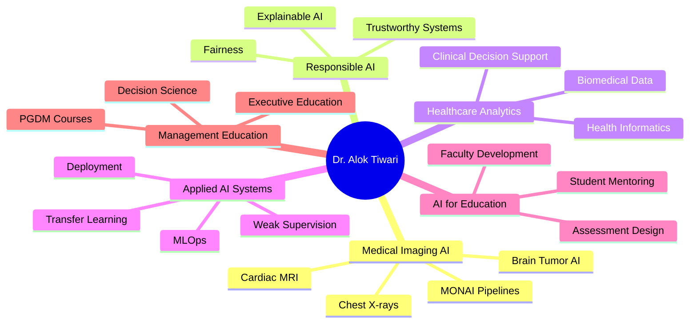

# Dr. Alok Tiwari

### Assistant Professor, Big Data Analytics · PhD, IIT-BHU · AI Researcher, Educator, Builder

  
  
  
  
  

  
  
  
  

---

## About Me

I am an **Assistant Professor in Big Data Analytics at Goa Institute of Management (GIM), Goa**, with a **PhD in Biomedical Engineering from IIT-BHU**. My work combines **medical imaging AI, healthcare analytics, explainable AI, responsible AI, MLOps, and generative AI** with a strong teaching and applied problem-solving orientation.

I work at the intersection of **research, education, and implementation**—designing AI systems, building academic and institutional tools, mentoring students, and delivering executive/faculty development programmes for industry and academia.

---

## At a Glance

<table>
<tr>
<td align="center" width="25%">
 
Peer-reviewed research publications
</td>
<td align="center" width="25%">
 
Under review / in preparation
</td>
<td align="center" width="25%">
 
Designed and delivered at GIM
</td>
<td align="center" width="25%">
 
Reached through MDPs
</td>
</tr>
</table>

<table>
<tr>
<td valign="top" width="50%">

### Research Themes
- Medical Imaging AI
- Chest X-ray Classification
- Cardiac MRI Segmentation
- Transfer Learning
- Weakly Supervised Learning
- Explainable & Responsible AI
- Healthcare Analytics
- Clinical Decision Support
- NLP, LLMs, and Generative AI
- MLOps and Reproducible AI Systems

</td>
<td valign="top" width="50%">

### Academic & Professional Highlights
- PhD, **IIT-BHU** · Biomedical Engineering
- Assistant Professor, **GIM Goa**
- Delivered **7 PGDM-level courses**
- Delivered MDPs for **MetLife, IOCL, Delhivery, Konkan Railways**
- Facilitated FDPs for **Government of Goa / E&ICT Academy**
- Supervised **14 PGDM-HCM research projects**
- Supervised **15 summer internship projects**
- **44 citations** · **h-index: 4**

</td>
</tr>
</table>

---

## Core Expertise

  

  
  
  
  
  
  

<b>Expanded technical stack</b>

 

- **Programming:** Python, R, MATLAB, C, SQL, NoSQL, LaTeX  
- **Deep Learning & ML:** PyTorch, TensorFlow, Keras, scikit-learn, OpenCV, MONAI, CNNs, RNNs, LSTM, Transformers, LLMs  
- **Data Science & Visualization:** NumPy, Pandas, Matplotlib, Seaborn, Plotly, Tableau, Power BI, RStudio  
- **MLOps / DevOps:** Git, GitHub, Docker, Jenkins, CI/CD, MLflow, FastAPI, Ngrok  
- **Big Data Engineering:** Hadoop, Spark, Hive, Kafka, Spark Streaming  
- **Databases:** MySQL, HBase, MongoDB, RDBMS  
- **Medical Imaging:** ImageJ, FSLeyes, MATLAB Image Processing Toolbox, DICOM, MONAI  
- **Cloud / HPC:** Azure, Azure Data Factory, Azure Databricks, GPU Workstation, Param Shivay Supercomputer  

---

## Featured Projects

> I prioritize repositories that reflect **original work, educational innovation, healthcare AI alignment, or real-world decision-support value**.

| Project | Area | Why it stands out |
|---|---|---|
| [AI-Resistant-Assessment-Studio](https://github.com/dr-alok-tiwari/AI-Resistant-Assessment-Studio) | AI for Education | A tool for designing assessment tasks that foreground reasoning, originality, and authentic thinking in the GenAI era. |
| [fix-the-friction-staff-retreat-2026](https://github.com/dr-alok-tiwari/fix-the-friction-staff-retreat-2026) | Institutional Analytics | Converts stakeholder pain points into an interactive and constructive decision-support system. |
| [dr-alok-tiwari.github.io](https://github.com/dr-alok-tiwari/dr-alok-tiwari.github.io) | Academic Portfolio | Personal academic website and central professional identity hub. |
| [ai4edu.github.io](https://github.com/dr-alok-tiwari/ai4edu.github.io) | AI for Education | Public-facing hub for AI-enabled teaching and learning resources. |
| [AshaAid](https://github.com/dr-alok-tiwari/AshaAid) | Social / Health AI | Human-centered applied AI direction with strong social impact potential. |
| [brain_tumor_classification](https://github.com/dr-alok-tiwari/brain_tumor_classification) | Medical Imaging AI | Strong alignment with healthcare AI, imaging analysis, and deep learning expertise. |

---

## Publications Snapshot

### Journal Articles
- **2023** · *Cascaded model (conventional + deep learning) for weakly supervised segmentation of left ventricle in cardiac magnetic resonance images*  
  **IETE Technical Review** · Taylor & Francis · DOI: `10.1080/02564602.2022.2055668`

- **2023** · *A comprehensive review on technological advances in alternate drug discovery: drug repurposing*  
  **Current Trends in Biotechnology and Pharmacy** · DOI: `10.5530/ctbp.2023.17`

- **2022** · *Detection of COVID-19 infection in CT and X-ray images using transfer learning*  
  **Technology and Health Care** · IOS Press · DOI: `10.3233/THC-220114`

- **2022** · *Deep learning-based automated multiclass classification of chest X-rays into COVID-19, normal, bacterial pneumonia, and viral pneumonia*  
  **Cogent Engineering** · Taylor & Francis · DOI: `10.1080/23311916.2022.2105559`

### Other Scholarly Contributions
- **1** Springer book chapter
- **3** conference papers
- Active pipeline in **computational psychiatry, bioinformatics, agriculture AI, AI washing, HRM analytics, and fairness-aware credit scoring**

---

## Teaching, Training, and Mentoring

<table>
<tr>
<td valign="top" width="50%">

### Academic Courses
- Healthcare Analytics
- Machine Learning with Generative AI
- MLOps (Managerial)
- Introduction to Programming (Python & R)
- AR/VR for Managers
- Operations Strategy in the Era of AI
- Logical Reasoning & Critical Thinking

</td>
<td valign="top" width="50%">

### Executive / Faculty Programmes
- AI in Accounting & Finance — **MetLife**
- Data Analytics for Decision Making — **IOCL**
- Storytelling with Data — **Delhivery**
- AI in Railways — **Konkan Railways**
- Introduction to Python / Generative AI / AI Tools for Pedagogy — **Government of Goa / E&ICT Academy**

</td>
</tr>
</table>

### Mentorship Footprint
- Guided **14 PGDM-HCM sectoral research projects**
- Guided **15 summer internship projects**
- Delivered faculty recruitment seminars at **IIT Delhi (DMS)** and **IIT Kharagpur (VGSOM)**

---

## Academic Service, Fellowships, and Recognition

- **Senior Research Fellow (SRF)**, MHRD, Government of India, IIT-BHU  
- **Junior Research Fellow (JRF)**, MHRD, Government of India, IIT-BHU  
- **Teaching Assistantship**, MHRD, NIT Kurukshetra  
- **GATE Qualified** three times: 2014, 2016, 2017  
- **M.Tech with Honours** · **B.Tech with Honours**  
- Appreciation Letter from **Government of Goa / E&ICT Academy**  
- Journal Reviewer: **Journal of Human Values**  
- Technical Book Reviewer: **Packt Publishing**  
- LinkedIn Page Administrator, Big Data Analytics Group, GIM Goa  
- Library Committee Member, GIM Goa  

---

## Research Vision

---

## GitHub Analytics

  
  

  

  

  

---

## Open to Collaborations

I am open to meaningful collaborations in:
- **Medical imaging AI and healthcare analytics**
- **Explainable, responsible, and trustworthy AI**
- **AI for education and assessment innovation**
- **MLOps, deployment, and reproducible AI pipelines**
- **Research writing, academic product development, and applied analytics training**

---

### *AI for real-world challenges · Medical imaging AI · Healthcare analytics · Management education · Research-ready systems*

