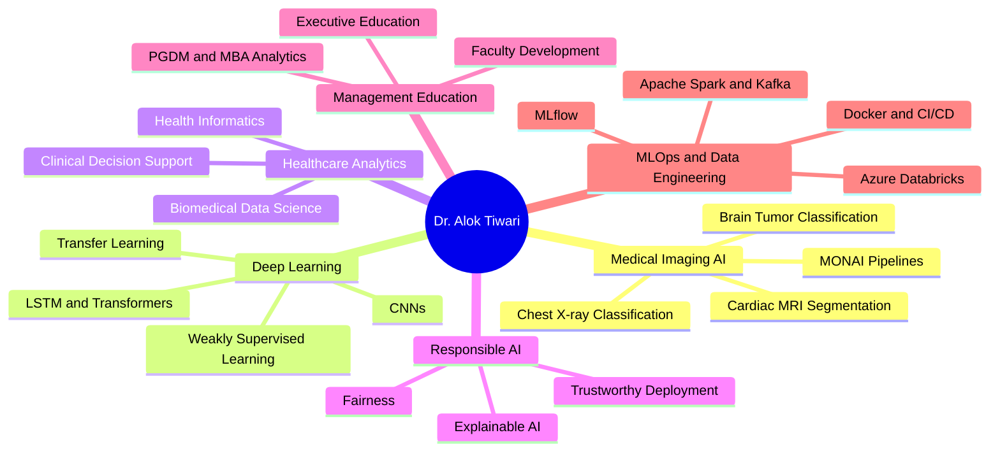

<!--
CV-enriched GitHub profile README for: https://github.com/dr-alok-tiwari
Updated from Dr. Alok Tiwari CV, April 2026.
-->

### Assistant Professor, Big Data Analytics · PhD, IIT-BHU · Medical Imaging AI & Healthcare Analytics

I build, teach, and translate AI systems for real-world decision-making across healthcare analytics, medical imaging, explainable AI, responsible AI, MLOps, data engineering, generative AI, and management education.

---

## Professional Snapshot

<table>
<tr>
<td width="50%" valign="top">

### Current Role
- **Assistant Professor, Big Data Analytics**, Goa Institute of Management, Goa
- PhD in **Biomedical Engineering**, IIT-BHU, Varanasi
- Research focus: **medical imaging AI, transfer learning, weakly supervised learning, XAI, responsible AI, healthcare analytics, MLOps**
- Teaching and training across **PGDM, MBA, executive education, FDPs, and MDPs**

</td>
<td width="50%" valign="top">

### Quantified Academic Profile
- **4** peer-reviewed journal articles
- **1** Springer book chapter
- **3** conference papers
- **6** manuscripts under review / preparation
- **44** Google Scholar citations · **h-index: 4**
- **7** PGDM-level courses designed/delivered at GIM
- **4** industry MDP clients reaching **100+ senior executives**

</td>
</tr>
</table>

---

## What I Work On

<table>
<tr>
<td width="33%" valign="top">

### Healthcare AI
- Chest X-ray classification
- Cardiac MRI segmentation
- Clinical decision support
- Medical imaging pipelines
- MONAI and DICOM workflows

</td>
<td width="33%" valign="top">

### Applied AI & MLOps
- Deep learning and computer vision
- Explainable and responsible AI
- MLflow, FastAPI, Docker, CI/CD
- Cloud and big-data workflows
- Reproducible AI systems

</td>
<td width="33%" valign="top">

### AI for Education
- Generative AI for pedagogy
- AI-resistant assessment design
- Analytics for management education
- Faculty development programmes
- Student mentoring and research training

</td>
</tr>
</table>

---

## Featured Original Projects

| Project | Focus | Why it matters |
|---|---|---|
| [AI-Resistant-Assessment-Studio](https://github.com/dr-alok-tiwari/AI-Resistant-Assessment-Studio) | AI in Education, Assessment Design | Designs assessment tasks that evaluate reasoning, originality, and contextual thinking in the GenAI era. |
| [fix-the-friction-staff-retreat-2026](https://github.com/dr-alok-tiwari/fix-the-friction-staff-retreat-2026) | Institutional Process Analytics | Converts stakeholder inputs into an interactive and constructive decision-support presentation. |
| [dr-alok-tiwari.github.io](https://github.com/dr-alok-tiwari/dr-alok-tiwari.github.io) | Academic Portfolio | Central web identity for research, teaching, projects, and collaborations. |
| [ai4edu.github.io](https://github.com/dr-alok-tiwari/ai4edu.github.io) | AI for Education | Public-facing AI learning and education resource hub. |
| [AshaAid](https://github.com/dr-alok-tiwari/AshaAid) | AI for Social / Health Impact | Candidate flagship project for human-centered applied AI. |
| [brain_tumor_classification](https://github.com/dr-alok-tiwari/brain_tumor_classification) | Medical Imaging AI | Directly aligns with medical imaging, deep learning, and healthcare AI expertise. |

---

## Research Identity

---

## Publications and Research Pipeline

### Peer-Reviewed Journal Articles

| Year | Publication | Venue |
|---|---|---|
| 2023 | Cascaded conventional + deep learning model for weakly supervised left-ventricle segmentation in cardiac MRI | *IETE Technical Review*, Taylor & Francis, Q2. DOI: `10.1080/02564602.2022.2055668` |
| 2023 | Comprehensive review on technological advances in alternate drug discovery and drug repurposing | *Current Trends in Biotechnology and Pharmacy*. DOI: `10.5530/ctbp.2023.17` |
| 2022 | Detection of COVID-19 infection in CT and X-ray images using transfer learning | *Technology and Health Care*, IOS Press, Q3. DOI: `10.3233/THC-220114` |
| 2022 | Deep learning-based automated multiclass classification of chest X-rays into COVID-19, normal, bacterial pneumonia, and viral pneumonia | *Cogent Engineering*, Taylor & Francis, Q2. DOI: `10.1080/23311916.2022.2105559` |

### Other Scholarly Outputs

- Springer book chapter on neuroimaging tools for identifying blockage locations.
- Conference work on deep learning for brain stroke detection, modified Pan-Tompkins ECG arrhythmia detection, and Simulink-based cardiac arrhythmia modeling.
- Current manuscript pipeline spans **computational psychiatry, bioinformatics, sustainable agriculture, AI washing, HRM value profiles, and fairness-aware credit scoring**.

---

## Teaching, Executive Education, and Mentoring

<table>
<tr>
<td width="50%" valign="top">

### PGDM / MBA Courses
- Healthcare Analytics
- Machine Learning with Generative AI
- MLOps (Managerial)
- Introduction to Programming: Python and R
- AR/VR for Managers
- Operations Strategy in the Era of AI
- Logical Reasoning and Critical Thinking

</td>
<td width="50%" valign="top">

### Executive and Faculty Programmes
- MetLife: AI in Accounting and Finance
- IOCL: Data Analytics for Decision Making
- Delhivery: Storytelling with Data
- Konkan Railways: AI in Railways
- Government of Goa / E&ICT Academy: Python, Generative AI, AI Tools for Pedagogy

</td>
</tr>
</table>

### Supervision and Mentorship

- Supervising **14 PGDM-HCM students** on healthcare management sectoral research projects.
- Supervising **15 students** on summer internship projects.
- Delivered faculty recruitment seminars at **IIT Delhi DMS** and **IIT Kharagpur VGSOM** on transfer learning in healthcare AI.

---

## Technical Stack

### Skills Map

| Area | Tools / Methods |
|---|---|
| Programming | Python, R, MATLAB, C, SQL, NoSQL, LaTeX |
| Deep Learning and ML | PyTorch, TensorFlow, Keras, scikit-learn, OpenCV, CUDA, cuDNN, MONAI, CNN, RNN, LSTM, Transformers, LLMs, NLP, XAI, Responsible AI |
| Data Science and Visualization | NumPy, Pandas, Matplotlib, Seaborn, Plotly, Tableau, Power BI, RStudio |
| MLOps and DevOps | Git, GitHub, Docker, Jenkins, CI/CD, MLflow, FastAPI, Ngrok |
| Big Data Engineering | Hadoop, Spark, Hive, Kafka, Spark Streaming |
| Databases | MySQL, HBase, MongoDB, RDBMS |
| Medical Imaging | ImageJ, FSLeyes, MATLAB Image Processing Toolbox, MONAI, DICOM |
| Cloud and HPC | Microsoft Azure, Azure Data Factory, Azure Databricks, GPU workstation, Param Shivay Supercomputer |

---

## Fellowships, Awards, and Academic Service

- **Senior Research Fellow (SRF)**, MHRD, Government of India, IIT-BHU.
- **Junior Research Fellow (JRF)**, MHRD, Government of India, IIT-BHU.
- **Teaching Assistantship**, MHRD, Government of India, NIT Kurukshetra.
- **GATE qualified three times**: 2014, 2016, 2017.
- **M.Tech with Honours**, NIT Kurukshetra.
- **B.Tech with Honours**, Gautam Buddha Technical University.
- Appreciation Letter from **Government of Goa / E&ICT Academy** for FDP contribution.
- Journal reviewer: *Journal of Human Values*.
- Technical book reviewer for Packt Publishing AI/ML titles.
- LinkedIn Page Administrator, Big Data Analytics Group, GIM Goa.
- Library Committee Member, GIM Goa.

---

## Repository Map

| Category | What belongs here | Action |
|---|---|---|
| Flagship Original Projects | AI-Resistant-Assessment-Studio, AshaAid, brain_tumor_classification | Pin, add screenshots, demo links, installation steps, and citation note |
| Teaching and Academic Tools | ai4edu.github.io, course demos, assessment tools | Add learning outcomes, classroom use cases, and faculty guide |
| Healthcare AI | X-ray, MRI, tumor classification, clinical AI experiments | Add dataset notes, model cards, ethics note, and reproducibility instructions |
| MLOps and Deployment | Flask, Streamlit, FastAPI, Docker, CI/CD projects | Add architecture diagram and deployment instructions |
| Curated Learning Resources | Forked books, guides, reference lists | Label clearly as curated / forked learning resources |
| Archive Candidates | Empty, duplicate, outdated, or unfinished repos | Archive or make private if they dilute the profile |

---

## Suggested Pinned Repositories

1. `AI-Resistant-Assessment-Studio` — strongest GenAI + education positioning.
2. `fix-the-friction-staff-retreat-2026` — practical institutional analytics and interactive presentation work.
3. `dr-alok-tiwari.github.io` — central academic and professional web identity.
4. `ai4edu.github.io` — AI education identity and public learning hub.
5. `AshaAid` — applied social/health impact AI.
6. `brain_tumor_classification` — healthcare AI and computer vision alignment.

---

## GitHub Activity

---

## Collaboration

I am open to collaborations in medical imaging AI, healthcare analytics, explainable AI, responsible AI, MLOps, AI for education, research-support tooling, and executive education in analytics.

---

**AI for real-world challenges · Medical imaging AI · Healthcare analytics · Management education · Research-ready systems**

